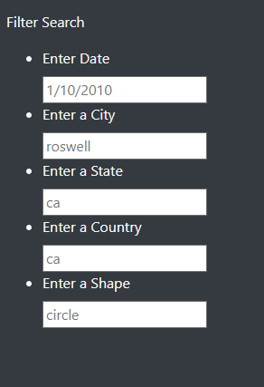
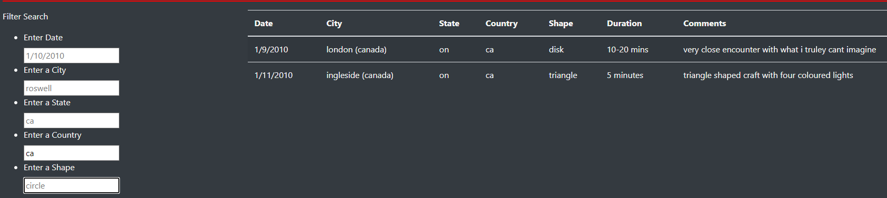

# UFOS with JavaScript Challenge

## Overview
With  this challenge we were able to implement some functionalities of JavaScript and learn how to create a web page using HTML and some of CSS and then add functions using JavaScript that was integrated into our HTML file.

This was a way to filter the data given by a JS file that holds some UFOs interactions.

## Result

As a result we got a page with a table that hold the data and that we can filter in order to find information needed, such as the city where the UFO was saw or the country.

We were using TextBox to get the values we want to use to filter the data.

And then using this filter we can get results such as this, were we filter how many UFOs were seen in Canada. 

## Summary

As we can see the filters to get the data that we want were really useful in order to find specific information.

We can change some structure to give the web page another appearance, we can make the filters with some spinners in order to select available countries and cities.

Also another thing we can do is implement some form to fill to later add further information or add a column that could show us an image.

